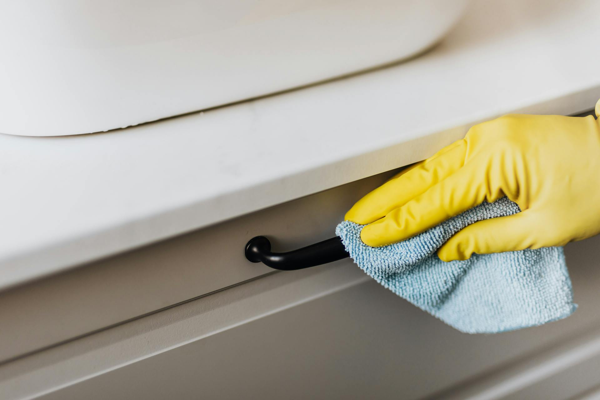

# ARCHIE'S OUTLET

A modern, SEO-friendly static website for ARCHIE'S OUTLET — Natural Liquid Soaps, Detergents, and Cleaning Products in Kenya.

## Features

- Multi-page static site (Home, Shop, About, Contact)
- Product filtering, search, and sorting
- Responsive design for mobile and desktop
- Product images and categories
- Cart functionality (client-side)
- SEO meta tags and Open Graph/Twitter Card
- Security best practices for static hosting
- Testimonial section for customer trust

## Technologies

- HTML5, CSS3, JavaScript (vanilla)

## Screenshots



## Getting Started

1. Clone or download this repository.
2. Open `index.html` in your browser.
3. Customize product data in `js/products.js` and images in `pictures/`.

## Folder Structure

```
├── index.html
├── shop.html
├── about.html
├── contact.html
├── js/
│   ├── main.js
│   └── products.js
├── css/
│   └── styles.css
├── pictures/
│   └── [product images]
```

## Security & SEO

- See HTML comments for security best practices.
- All pages include relevant meta tags for SEO and social sharing.

## License

MIT

---

> Built with ❤️ by ARCHIE'S OUTLET
